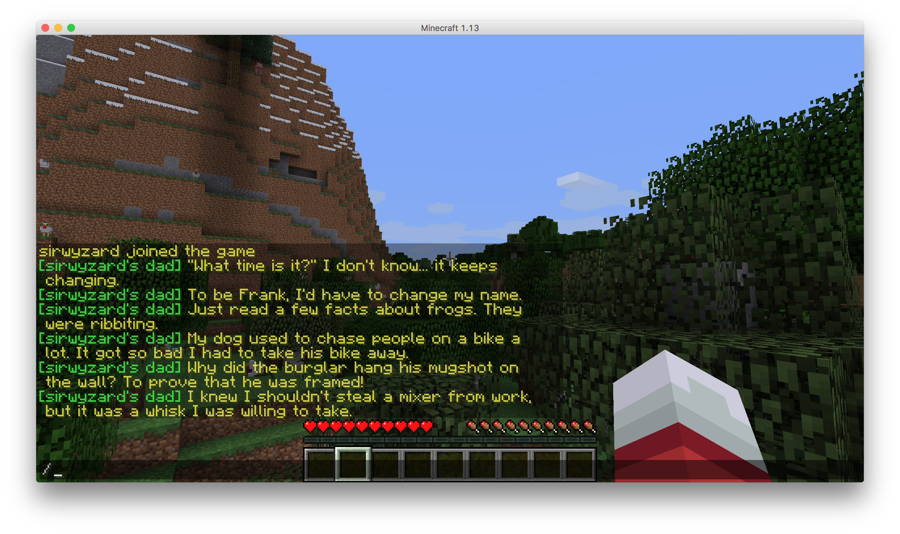

# Jokes - Your Premier Dad Jokes Plugin!

This plugin makes use of the `icanhazdadjoke.com` api to retrieve fresh dad jokes for your gaming amusement.

## Installation

Build with Maven (or IntelliJ IDEA CE build) and place the resulting `jokes-1.0-SNAPSHOT.jar` file in your Minecraft server's `/plugins` folder. You can also fine the latest .jar file under [project releases](https://github.com/halfnibble/jokesmc/releases).

## Usage

Any player can request a dad joke by type the command:

    /joke
    
## Results

